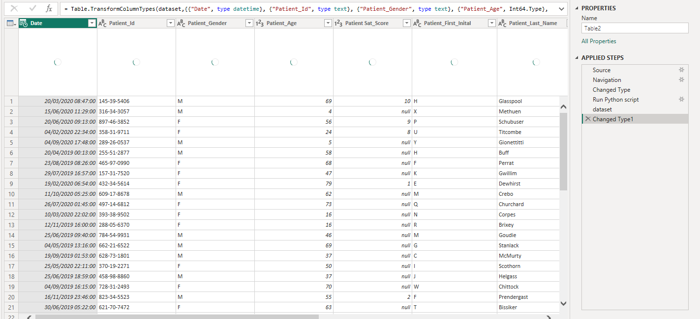
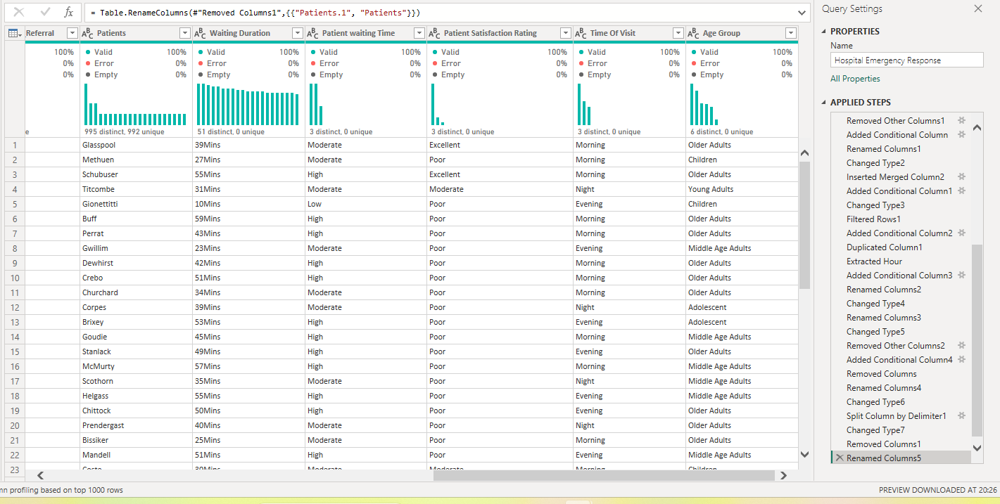
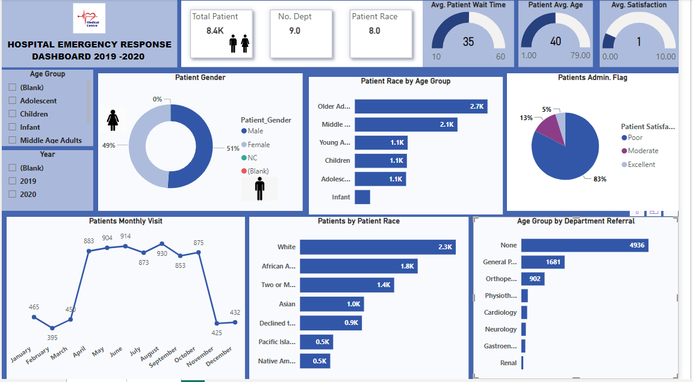
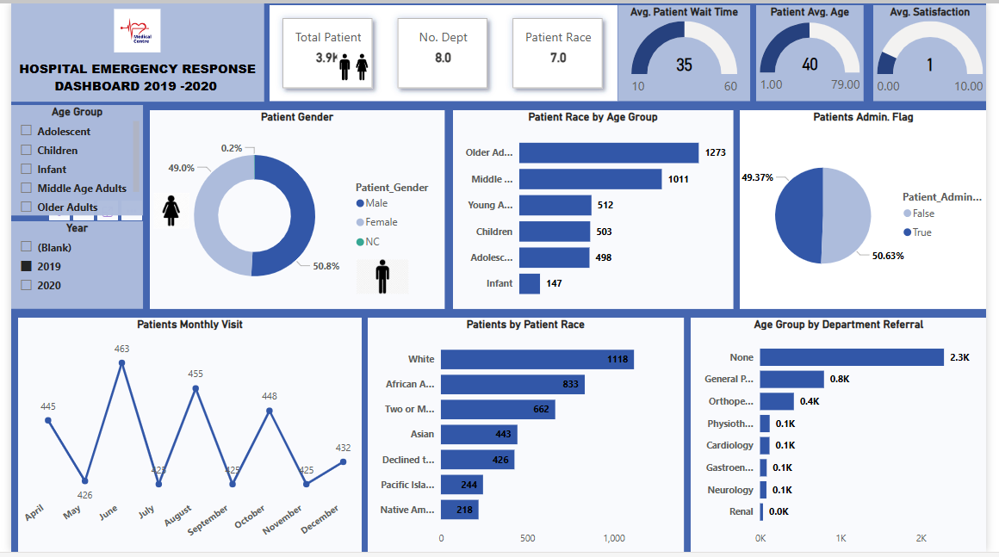
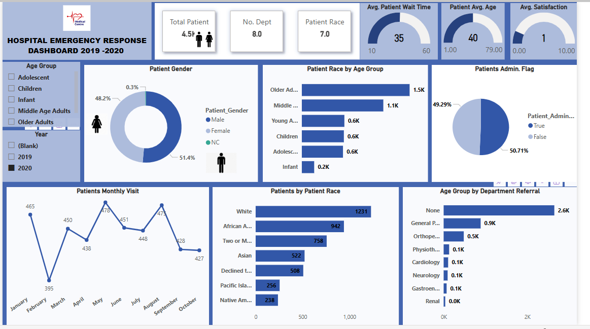

# HOSPITAL EMERGENCY  RESPONSE FOR 
###    APRIL,2019 -OCTOBER,2020

# Introduction:

Optimizing patient care and response allocation is crucial in the healthcare sector.
Statistics revealed that the average waiting time in emergency departments has increased by 15%. This analysis aims to delve into the intricacies of emergency response, uncover critical insights for patient care, and facilitate proper resource management and allocation. 

•	**_Disclaimer_** : _ All datasets and reports used in this project are fictional and do not represent any specific company, institution, or country. They serve solely to demonstrate the capabilities of Power BI.._

## Data Sourcing:

The dataset was obtained from the Kaggle website containing 12 columns and 8400 rows. It is an Excel file loaded into Power Query for transformation and cleaning purposes.

## Visualisation:
The report comprises 2 pages: A Dashboard and the dataset Overview of Analysis
You can interact with the report here (Report Link- https://tinyurl.com/hospitalemergency)

## Power BI Concepts applied:
** Data Cleaning
** Data Manipulation
** DAX (Custorm measures, Aggregates functions, conditional columns

## Summary of Findings:

## 1.	Total Patients:
o	There are 8,400 patients across 8 different departments.
o	These numbers are essential for resource allocation and capacity planning.

## 2.	Average Patient Wait Time:
o	The average patient wait time remains at 35 minutes.
o	Addressing this metric is critical for improving patient experience.

## 3.	Patient Demographics:
o	Patients were represented from 7 different races.
o	Understanding the diversity of patients helps tailor care and services.

## 4.	Patient Average Age:
o	The average age of patients is 40. 

Understanding the age distribution helps tailor services and resources accordingly.

## 5.	Satisfaction Ratings:
o	Overall satisfaction is low (1 out of 10) amounting to 83%.
o	Interestingly, infants had a slightly better experience (rating of 2) with waiting times in 2019 (33 and 34 minutes). There is need for other Age Groups to improve.

## 6.	Monthly Patient Visits:
#### Data gaps exist:
No data for January to April 2019.
No data for November to December 2020.
o	These gaps may explain the decline in patient visits during those months.

## 7.	Referral Sources:
#### Most referrals came from:
None (Unknown Source)
General Practice
Orthopaedics
Understanding referral patterns helps allocate resources effectively.

## Insights

## 2019 Dashboard                                               
    

## 2020 Dashboard
         

## Patient Volume:
•	Slight decrease YoY (4,650 in 2020-2021 vs. 3,900 in 2019-2020)

####  Wait Times:
•	Significant improvement YoY (Year over Year)

####  Patient Satisfaction:
•	Slight increase YoY 

## Patient Demographics
#### Age:
o	Middle-aged adults (40%) remain the most common age group.

o	Significant increase in children (48%) compared to last year (22%).

#### Gender:
o	Relatively even gender distribution (51% male, 49% female).

#### Race:
o	Relatively consistent racial demographics (79% White, 10% African American, 8% Asian, 3% Other).

## Departmental Referrals
#### General Pediatrics:
o	Remains the department with the most referrals (2,600).

o	There is significant decrease compared to last year (4,936), Orthopedics (500) and Cardiology (100) also show a decrease in referrals compared to 2019-2020.

## Conclusion / Recommendations:

## 1.	Address Waiting Time:
o	Urgent need to improve waiting times across all age groups.

o	Consider process optimization, staffing adjustments, and better resource allocation.

## 2.	Data Completeness:
o	Ensure complete data collection throughout the year to avoid gaps.

o	Accurate data is essential for decision-making.

## 3.	Referral Management:
o	Collaborate with referring sources (e.g., general practitioners, orthopedic clinics) to streamline referrals.

o	Enhance communication channels.

## 4.	Patient Satisfaction:
o	Implement strategies to improve overall satisfaction.

o	Address specific pain points identified in feedback.

😄:

:accessibility: http://www.linkedin.com/in/stella-ibor-2694ba241

📬 iboraboghenestella@gmail.com

